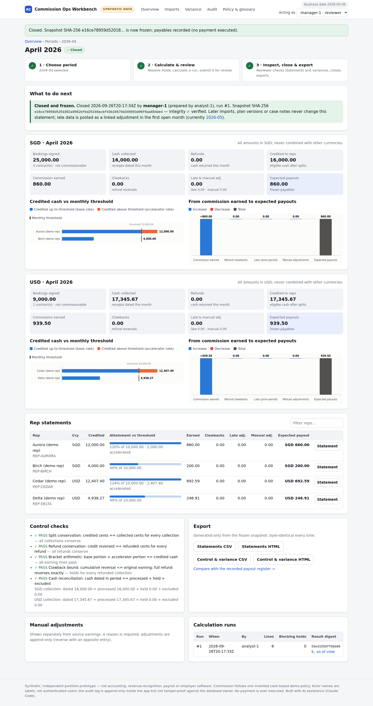
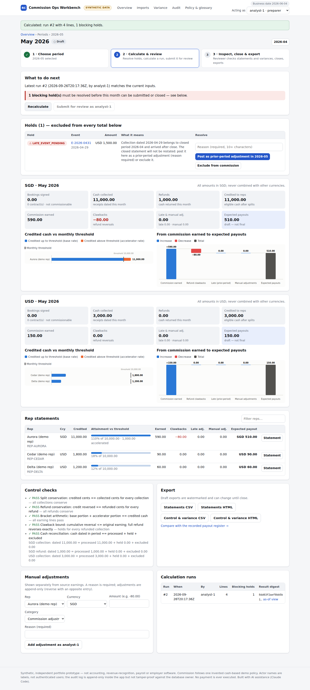
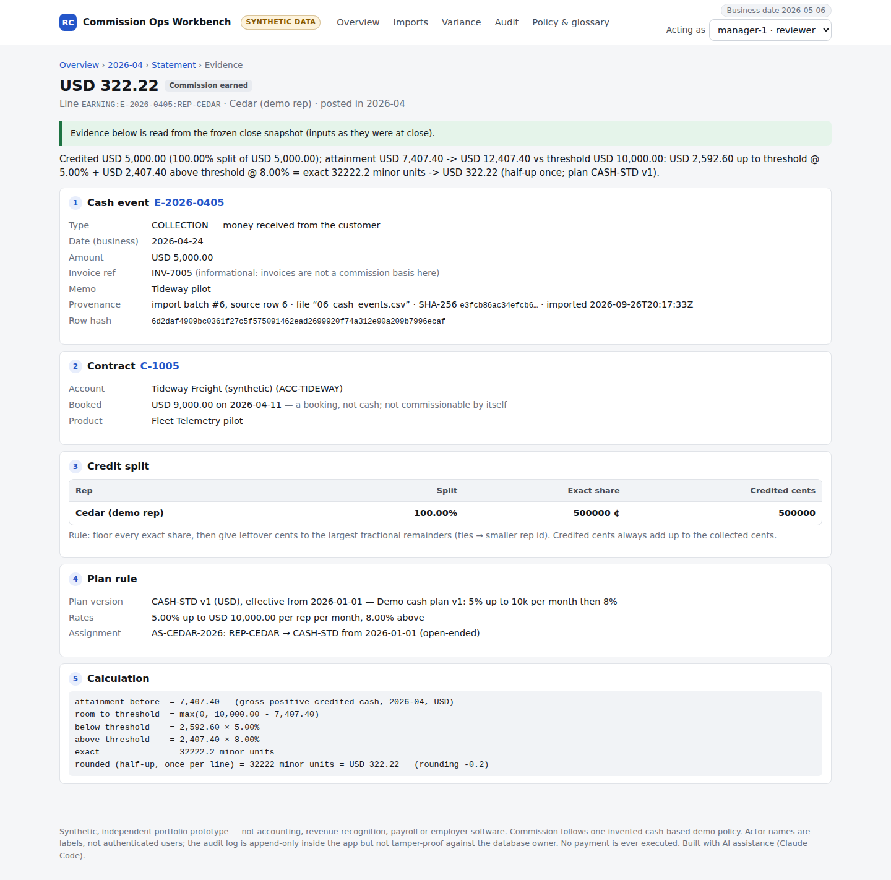

# Revenue & Commission Operations Workbench

At month-end, a sales-operations team has to turn customer payments into commission per salesperson,
explain every amount, and keep a finished month from changing when late or corrected data arrives.
This workbench imports the month's CSV files and calculates commission on cash collected under a
versioned plan. It traces every commission line back to its source row and freezes each reviewed month
as a snapshot. Late payments, refunds and payroll differences become reasoned adjustments and
investigation cases; closed months are never silently edited.

Python · SQLite · Flask · runs locally with an invented demo dataset ·
[one-page plain-English overview](docs/HR_OVERVIEW.md)

## What it does

| Step | Behaviour |
|---|---|
| **Import** | Seven CSV types: reps, plans, plan assignments, contracts, credit splits, cash events, payroll register. Each file is identified by SHA-256, so re-imports are skipped. Invalid rows are quarantined with a reason code, or the whole file is rejected in strict mode. Control totals prove read = accepted + duplicate + quarantined, in rows and in money. |
| **Calculate** | Commission on cash collected, not bookings or invoices. Shared deals are split to the exact cent, a monthly accelerator applies above a threshold, and refunds reverse the original earning. SGD and USD are never combined. |
| **Explain** | Per-rep statements. Each line links to its cash event, contract, split, plan rule and calculation. |
| **Review and close** | Draft → submit → close by a different user label. A review made stale by any data change is refused. The closed month is stored as a SHA-256 snapshot, and its exports come only from that snapshot. |
| **Late data** | A payment dated in a closed month does not reopen that month. It blocks the next open month until someone posts it as a prior-period adjustment or excludes it; either way a reason is required. |
| **Payroll variance** | Expected payouts are compared with the payroll register. Each difference becomes a case with owner, reason code, notes and a suggested cause. Resolving a case records the explanation; it does not pay anything. |
| **Audit and exports** | An append-only, hash-chained change log. CSV/HTML statements and control reports, with spreadsheet-formula protection. |

The same services run behind a local web UI with a guided demo and behind a command-line interface.

## Example: one salesperson's April in the demo

Cedar is paid on the demo plan: 5% on the first 10,000 collected in a month and 8% on the excess.

1. A customer pays **USD 12,345.67** on a deal shared 60/40 between Cedar and Delta. Cedar is credited
   **7,407.40** and Delta **4,938.27**. The leftover cent goes to the larger remainder, so the credits add
   up exactly to the payment. Cedar earns 7,407.40 × 5% = **370.37**.
2. A later **5,000.00** payment takes Cedar past 10,000. The first 2,592.60 earns 5% and the other
   2,407.40 earns 8%: 129.63 + 192.592 = 322.222, rounded once for the line to **322.22**. Cedar's
   April total is **692.59**.
3. The payroll register shows **620.37** for Cedar. The workbench opens a **−72.22** variance case and
   suggests the cause: the payout matches 5% on everything, so the 3% accelerator uplift on 2,407.40 is
   missing.

The rest of the demo plays out in May. A partial refund of an April sale is reversed at April's 8%
(−80.00), not at the new plan's 9%. A payment dated 29 April arrives after April was closed and blocks
May until it is posted as an adjustment. At the end of the demo, April's exported statement is
byte-for-byte unchanged.

## Screenshots

| April closed: frozen snapshot, controls, charts | Late April payment blocks May | Evidence chain for one line |
|---|---|---|
|  |  |  |

The full set of 13 screenshots is in [`docs/evidence/screenshots/`](docs/evidence/screenshots/). They
were recorded from an earlier commit, and four of them show on-screen wording that was later changed;
the numbers are the same ([provenance](docs/evidence/README.md)). An offline replay of the demo, built
from the recorded run, is at [`docs/presentation/walkthrough.html`](docs/presentation/walkthrough.html).

## Run it

```bash
git clone https://github.com/herui03/revenue-commission-workbench.git
cd revenue-commission-workbench

# 1) No install needed (Python 3.10+ standard library): play the whole story, write exports to out/demo/
python3 -m rcw demo

# 2) Web UI (needs Flask once):
python3 -m venv .venv && .venv/bin/pip install -r requirements.txt
.venv/bin/python -m rcw --db instance/demo_workbench.db serve --seed-if-missing
#    → open http://127.0.0.1:5057  (bound to localhost only)
```

**Mac:** after the one-time install above, double-click **`launch_demo.command`**. It keeps an existing
demo database, seeds one only if it is missing, and never installs packages. To start over, double-click
**`reset_demo.command`** and type `RESET`; a backup is kept in `instance/backups/`. If macOS says the file
"cannot be opened because it is from an unidentified developer", right-click it → **Open** → **Open**
once, or use the terminal command above.

The UI guides the three-minute demo story; a timed script is in
[`docs/07_demo_script.md`](docs/07_demo_script.md).

## Stack

- **Python 3.10+**: the domain engine, importer and CLI use only the standard library.
- **SQLite**: one local file. Database triggers make source, snapshot and audit tables append-only.
- **Flask + Jinja**: the web UI, bound to localhost, with CSRF tokens on every form and a
  Content-Security-Policy.
- **Money**: integer minor units and basis-point rates, with one half-up rounding per line and no
  floating point.
- **Testing**: unittest/pytest, and Playwright for the browser run.
- **CI**: GitHub Actions with a read-only token. It runs standard-library jobs on Python 3.10, 3.11
  and 3.12, plus a web and browser job.

## Checks

- **Hand calculations first**: 16 scenarios were worked out by hand and committed before the engine
  code, and the engine reproduces all 16 ([`tests/expected/HAND_CALCULATIONS.md`](tests/expected/HAND_CALCULATIONS.md)).
- **Automated tests**: 88 tests.
    - `python -m pytest` with `requirements-dev.txt` installed runs all 88 plus 301 subtests.
    - `python3 -m unittest discover -s tests -t .` with no install runs 81 and skips the 7 Flask tests.
- **Browser run**: Playwright clicks through the whole story and passes 19 checks. These include no
  console errors and no horizontal overflow at 1440 px and 390 px ([`docs/evidence/e2e_results.json`](docs/evidence/e2e_results.json)).
- **Benchmark**: 10,000 seeded cash events. An independent reference model matches all 480
  rep-month-currency totals ([`docs/08_benchmark.md`](docs/08_benchmark.md)).
- **Defect log**: 11 defects found and fixed, each with its root cause and regression test
  ([`docs/04_defects_log.md`](docs/04_defects_log.md)).

## Documentation

| | |
|---|---|
| [`docs/HR_OVERVIEW.md`](docs/HR_OVERVIEW.md) | one-page plain-English overview |
| [`docs/01_requirements_acceptance.md`](docs/01_requirements_acceptance.md) | scope, requirements, acceptance criteria |
| [`docs/02_data_dictionary.md`](docs/02_data_dictionary.md) | every CSV column, rule and reason code |
| [`docs/03_policy_decision_log.md`](docs/03_policy_decision_log.md) | policy choices, alternatives, trade-offs |
| [`docs/04_defects_log.md`](docs/04_defects_log.md) | defects, root causes, regression tests |
| [`docs/05_uat_matrix.md`](docs/05_uat_matrix.md) | evidence per requirement |
| [`docs/06_operations_sop.md`](docs/06_operations_sop.md) | monthly close procedure, error codes, reset and backup |
| [`docs/07_demo_script.md`](docs/07_demo_script.md) | 3-minute demo script |
| [`docs/08_benchmark.md`](docs/08_benchmark.md) | generated benchmark report |

## Layout

`rcw/` is the domain code, which needs only the standard library:

- `money.py`: integer money, rounding, allocation;
- `importer.py`: validation, idempotency, quarantine;
- `engine.py`: pure calculation;
- `services.py`: calculate → review → close, decisions, adjustments;
- `variance.py`, `exports.py`, `cli.py`.

`rcw/web/` is the Flask UI on the same services. The rest of the repository holds `data/demo/`
(demo fixtures), `tests/`, `scripts/` (E2E, benchmark, evidence, replay) and `docs/`.

## Scope and limits

- **Data**: all reps, customers, plans and payroll records are invented. The workbench is not
  connected to any payroll, bank or CRM system, and it executes no payments.
- **Policy**: the commission rules are one invented example chosen to make the mechanics visible.
  Alternatives are in [`docs/03_policy_decision_log.md`](docs/03_policy_decision_log.md).
- **Validation**: the checks above show that results are consistent with the invented rules on invented
  data. No acceptance testing with real users or business data has been done.
- **Security model**:
    - User names are labels, not logins, so the rule that a different person closes the month is
      illustrated, not enforced.
    - The hash-chained log can't be edited through the application, but it is not tamper-proof against
      whoever holds the SQLite file.
    - The workbench is single-user and local.
- **Not included**:
    - currency conversion;
    - revenue recognition;
    - draws or negative-balance carry-forward;
    - automatic handling of split changes after cash is collected, which need a manual adjustment;
    - periods outside the years 2000–2099.
